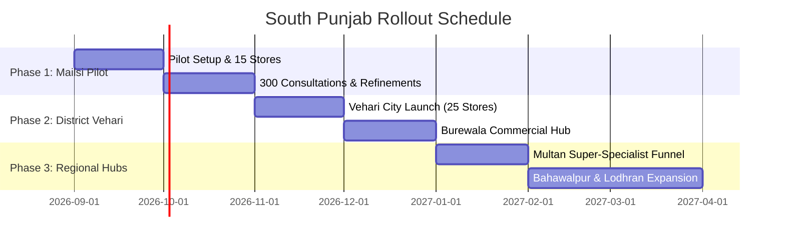

# Mailsi Pilot Strategy & South Punjab Expansion Playbook

This document outlines the on-ground execution strategy, stakeholder acquisition playbooks, operational routines, and geographical expansion roadmap for the Mailsi pilot and broader South Punjab rollout.

---

## 1. Geographical Landscape: Mailsi & Surrounding Catchment

```
                       ┌────────────────────────┐
                       │   Multan Medical Hub   │ (Super-Specialists)
                       └───────────▲────────────┘
                                   │ 1.5 - 2 Hours (85 km)
                       ┌───────────┴────────────┐
                       │      Mailsi Town       │ (Local THQ / Private Clinics)
                       └───────────▲────────────┘
                                   │
      ┌────────────────────────────┼────────────────────────────┐
      │ (~15 km)                   │ (~22 km)                   │ (~25 km)
┌─────┴──────────────┐   ┌─────────┴──────────┐   ┌─────────────┴────────┐
│ Mitro / Karampur   │   │ Jallah Jeem        │   │ Tibba Sultanpur      │
│ (Village Stores)   │   │ (River-Belt Area)  │   │ (Rural Trading Hub)  │
└────────────────────┘   └────────────────────┘   └──────────────────────┘
```

### Why Mailsi is the Ideal Pilot Ground:
1. **Diverse Connectivity Spectrum:** Covers well-connected town 4G down to weak river-belt edge connectivity (Sutlej area), allowing thorough testing of the voice-note fallback.
2. **Defined Rural Commute:** Villages like Mitro, Jallah Jeem, and Karampur are 15–25 km away, where patients currently spend 1–2 hours in Qingqi rickshaws just to get a clinic token.
3. **Established Referral Habits:** Medical store owners are already the informal triage point; digitizing them with an economic cut legitimizes and scales their role.

---

## 2. Stakeholder Acquisition & Pitch Playbooks

### A. Pitch to Village Medical Store Owners

> **The Hook:** *"Aapka patient Mailsi ya Multan ja kar dawai na le, aapke paas se le — aur har checkup par 7% naqad commission bhi payein."*

1. **Dual Revenue Stream:**
   - **Stream 1 (Booking Commission):** Instant 7% cash cut (e.g. Rs. 70 on a Rs. 1,000 consult).
   - **Stream 2 (Medicine Sales Margin):** As soon as the doctor finishes the call, the digital prescription arrives directly on the medical store's portal, enabling the store to prepare and sell the 5–7 day course of medications (earning their standard 15–20% pharmacy retail margin).
2. **Equipment Needed:** Any existing Android phone with WhatsApp and camera.
3. **Onboarding Steps:**
   - Sign up store profile (Name, Location, Owner Phone).
   - Provide branded counter standee: *"Yahan Mailsi aur Multan ke Mahir Doctors ka Online Checkup karwayein"*.
   - 10-minute training on how to enter BP, Sugar, and click old prescription photos in under 60 seconds.

---

### B. Pitch to Local Mailsi Doctors

> **The Hook:** *"Clinic par rush aur shor kam karein, tayyar vitals ke sath mareez dekhein, aur 88% poori fees payein."*

1. **Zero Financial Penalty:** Doctor receives **88%** net fee with no software subscription charge during pilot.
2. **Organized OPD:** Pre-recorded vitals (BP, Sugar, Temp, Pulse) entered by the village store saves 2–3 minutes per consultation.
3. **Flexible Evening Sessions:** Doctors can take 5–10 online appointments from home between 8:00 PM – 9:30 PM after their main physical clinic wraps up.

---

### C. Pitch to Multan Super-Specialists

> **The Hook:** *"South Punjab ke tehsil level patients ka organic referral pipeline bina satellite clinic kholey."*

1. **High Value for Patients:** Saves patient family Rs. 5,000+ in travel/food expenses to Multan.
2. **Follow-Up Stream:** Remote review of routine blood tests, ECG reports, and follow-up adjustments without filling their Multan waiting room.

---

## 3. Financial Settlement Operations

```
┌─────────────────────────┐
│ Village Patient         │
└────────────┬────────────┘
             │ Pays Rs. 1,000 Cash
             ▼
┌─────────────────────────┐
│ Medical Store Agent     │
├─────────────────────────┤
│ • Retains Rs. 70 (7%)   │
│ • Holds Rs. 930 balance │
└────────────┬────────────┘
             │ (Weekly Remittance via JazzCash / Easypaisa / Raast)
             ▼
┌─────────────────────────┐
│ Platform Escrow Account │
├─────────────────────────┤
│ • Retains Rs. 50 (5%)   │
│ • Pays Doctor Rs. 880   │ (Direct Bank / JazzCash Transfer within 24h)
└─────────────────────────┘
```

### Credit Limit & Balance Safeguard:
- Each medical store has an initial credit limit of **Rs. 5,000**.
- When accumulated unremitted balance exceeds Rs. 5,000, new bookings are temporarily gated until the store clears the ledger via JazzCash/Easypaisa to the platform account.

---

## 4. Phased Geographical Expansion Playbook



### Expansion Milestones:
- **Phase 1 (Month 1–2): Mailsi Tehsil**
  - Goal: 15–20 active medical stores, 5 local doctors, 2 Multan specialists.
  - Target Volume: 300–500 consultations.
- **Phase 2 (Month 3–4): Vehari District Hubs**
  - Replicate in **Vehari City** (District HQ) and **Burewala** (major agro-industrial city with dense private hospital clusters).
- **Phase 3 (Month 5–6): Multan Tertiary Anchor**
  - Partner with private hospitals in Multan (Fatima Medical Complex, Nishtar Road clinics) to establish dedicated tele-referral channels.
- **Phase 4 (Month 7+): South Punjab Network**
  - Expand to **Lodhran, Khanewal, Kehror Pakka, and Muzaffargarh**.
